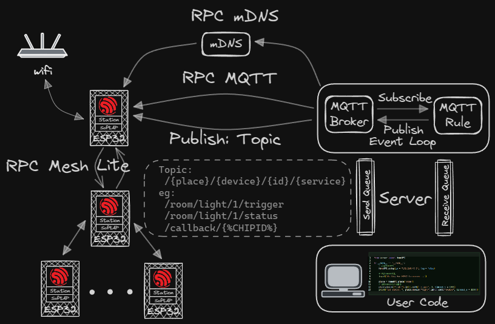

<div align="center">

# *HomeRPC*

[](https://www.freertos.org/)
[](https://docs.espressif.com/projects/esp-idf/en/latest/esp32/)
[](https://mqtt.org/)
[](./LICENSE)

### **适用于智能家居场景的嵌入式 RPC 框架**

</div>

## 🚀 项目介绍

**`HomeRPC`** 是一个面向智能家居场景的嵌入式 RPC 框架，旨在提供一种简单、高效的远程调用解决方案，非常适合与 **大语言模型** 进行结合，实现智能家居场景下的对话式交互。

## ⚙️ 实现原理



## 🛠️ 使用说明

`HomeRPC` 支持以下基本数据类型作为命令参数:

| 类型                    | 签名 | 示例  |
| ----------------------- | ---- | ----- |
| char(字符)              | c    | 'a'   |
| short、int、long(数字)  | i    | 123   |
| float(单精度浮点数)     | f    | 3.14  |
| double(双精度浮点数)    | d    | 3.141 |

其中 `rpc_any_t` 类型的定义如下:

```
typedef union {
    char c;
    unsigned char uc;
    short s;
    unsigned short us;
    int i;
    unsigned int ui;
    long l;
    float f;
    double d;
} __attribute__((aligned(1))) rpc_any_t;
```

### 📚 示例代码

`ESP32` 客户端示例代码如下:
```c
// file: main.c
#include "freertos/FreeRTOS.h"
#include "driver/gpio.h"
#include "HomeRPC.h"

#define BLINK_GPIO 2

static uint8_t s_led_state = 0;

static void configure_led(void) {
    gpio_reset_pin(BLINK_GPIO);
    gpio_set_direction(BLINK_GPIO, GPIO_MODE_OUTPUT);
}

// 触发LED
static rpc_any_t trigger_led(rpc_any_t state) {
    gpio_set_level(BLINK_GPIO, state.uc);
    rpc_any_t ret;
    ret.i = 0;
    return ret;
}

// 获取LED状态
static rpc_any_t led_status(void) {
    rpc_any_t ret;
    ret.uc = s_led_state;
    return ret;
}

void app_main(void) {
    configure_led();
    // 启动HomeRPC
    HomeRPC.start();
    // 服务列表
    Service_t services[] = {
        {
            .func = trigger_led,
            .input_type = "i",
            .output_type = 'i',
            .name = "trigger",
            .desc = "open the light",
        },
        {
            .func = led_status,
            .input_type = "",
            .output_type = 'i',
            .name = "status",
            .desc = "check the light status",
        }
    };
    // 设备信息
    Device_t led = {
        .place = "room",
        .type = "light",
        .id = 1,
        .services = services,
        .services_num = sizeof(services) / sizeof(Service_t)
    };
    // 注册设备
    HomeRPC.addDevice(&led);
    // 调用服务
    Device_t led2 = {
        .place = "room",
        .type = "light",
        .id = 1
    };

    while (1) {
        vTaskDelay(5000 / portTICK_PERIOD_MS);
        // 调用服务
        rpc_any_t status = HomeRPC.callService(&led2, "status", NULL, 10);
        printf("led status: %d\n", status.i);
    }
}
```

`Broker` 服务端示例代码如下:
```Python
# file: server.py
from server import HomeRPC

if __name__ == '__main__':
    # 启动HomeRPC
    HomeRPC.setup(ip = "192.168.43.9", log = True)

    # 等待ESP32连接
    input("Waiting for ESP32 to connect...")
    
    place = HomeRPC.place("room")
    # 调用ESP32客户端服务
    place.device("light").id(1).call("trigger", 1, timeout_s = 10)
    print("led status: ", place.device("light").id(1).call("status", timeout_s = 10))
```
## 使用方法

1. 将 `HomeRPC` 组件添加到您的 `ESP-IDF` 项目中:
```bash
cd ~/my_esp_idf_project
mkdir components
cd components
git clone https://github.com/guidons-master/HomeRPC.git
```
2. 在 `menuconfig` 中配置 `HomeRPC`

## 🧑‍💻 维护人员

- [@guidons](https://github.com/guidons-master)
- [@Hexin Lv](https://github.com/Mondaylv)